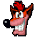
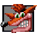

# Crate Mod Loader Supported Games

Featured:
* [Crash Nitro Kart](#crash-nitro-kart-)
* [Crash Twinsanity](#crash-twinsanity-)
* [Crash Tag Team Racing](#crash-tag-team-racing-)
* [Rayman 3: Hoodlum Havoc](#rayman-3-hoodlum-havoc-)
* [Crash Bandicoot](#crash-bandicoot-)
* [Crash Bandicoot 2: Cortex Strikes Back](#crash-bandicoot-2-cortex-strikes-back-)
* [Crash Bandicoot: WARPED](#crash-bandicoot-warped-)

Additionally supported:
* [CTR: Crash Team Racing](#ctr-crash-team-racing-)
* [Crash of the Titans](#crash-of-the-titans-)
* [Crash: Mind Over Mutant](#crash-mind-over-mutant-)

## Crash Nitro Kart 

Click to view details

  
Supported: All PS2 versions (.ISO format), All GC versions (.ISO format), All XBOX versions (.ISO format)  
Mod abbreviation: CrashNK  
Mod Menu enabled.  
Tools/API by BetaM, ManDude and eezstreet.  
### Features:  
- Randomize Adventure  
- Randomize Character Stats
- Randomize Kart Stats
- Randomize Powerup Effects
- Randomize Drivers  
- Randomize Karts  
- Disable Fadeout/Flash Overlay
- Disable Unlock Popups
- Speed Up Mask Hint Appearance  
- Remove Intro Videos  
- Version, seed and settings visible in the Credits screen

  
## Crash Twinsanity 

Click to view details

Supported: All PS2 versions (.ISO format), All XBOX versions (.ISO format)    
Mod abbreviation: CrashTS  
Mod Menu enabled.  
API by NeoKesha, Smartkin, ManDude and Marko. (https://github.com/Smartkin/twinsanity-editor)  
### Features:  
- Randomize Crate Types  
- Randomize Individual Crates
- Randomize Gem Locations   
- Randomize Level Music  
- Randomize Character Parameters  
- Enable Flying Kick for Crash (Jump + Slide)  
- Enable Stomp Kick for Crash (Flying Kick replacement)  
- Enable Double Jump for Cortex  
- Enable Double Jump for Nina  
- Enable Unused Enemies  
- Version, seed and settings visible in the Autosave Disabled screen  

  
## Crash Tag Team Racing 

Click to view details

Supported: All PS2 versions (.ISO format), All GC versions (.ISO format), All PSP versions (.ISO format), All XBOX versions (.ISO format)  
Mod abbreviation: CrashTTR  
APIs by NeoKesha and BetaM. (based on https://github.com/handsomematt/Pure3D)  
### Features:  
- Randomize Platforming Character
- Randomize Track Entrances
- Randomize Minigames
- Randomize Race Laps
- Prevent Sequence Breaks
- Version, seed and settings visible in the Credits screen

  
## Rayman 3: Hoodlum Havoc 

Click to view details

Supported: All PS2 versions (.ISO format), All GC versions (.ISO format), All XBOX versions (.ISO format)  
Mod abbreviation: Rayman3  
### Features:
- Randomize Level Order (Any amount of Levels)  
- Randomize Outfit Visuals (GC Only)  
- New Game Into 2D Nightmare (GC Only)  
- Remove Intro Videos (GC Only)  

  
## Crash Bandicoot 

Click to view details

  
Supported: All PS1 versions (.BIN/.ISO formats)  
Mod abbreviation: Crash1  
API by chekwob and ManDude. (https://github.com/cbhacks/CrashEdit)  
### Features:  
- All Crates Are Blank
- All Crates Are Wumpa
- Backwards Levels
- Random Levels Are Backwards
- Randomize Crate Contents
- Randomize Boss Levels
- Wider Camera Field-Of-View
- Randomize Camera Field-Of-View
- Randomize World Colors
- Randomize World Palette
- Randomize Sound Effects  
- Version and seed visible in the Main Menu

  
## Crash Bandicoot 2: Cortex Strikes Back 

Click to view details

Supported: All PS1 versions (.BIN/.ISO formats)  
Mod abbreviation: Crash2  
API by chekwob and ManDude. (https://github.com/cbhacks/CrashEdit)  
### Features:  
- All Crates Are Blank
- All Crates Are Wumpa
- Randomize Warp Room Exits
- Backwards Levels 
- Random Levels Are Backwards
- Randomize Crate Contents
- Randomize Crate Counter
- Randomize Boss Levels
- Wider Camera Field-Of-View
- Randomize Camera Field-Of-View
- Randomize World Colors
- Randomize World Palette
- Greyscale World
- Untextured World
- Randomize Sound Effects  
- Version and seed visible in the Pause screen in the Warp Room (English only)  

  
## Crash Bandicoot: WARPED 

Click to view details

Supported: All PS1 versions (.BIN/.ISO formats)  
Mod abbreviation: Crash3  
API by chekwob and ManDude. (https://github.com/cbhacks/CrashEdit)  
### Features:  
- All Crates Are Blank
- Randomize Warp Room
- Backwards Levels
- Random Levels Are Backwards
- Randomize Crate Contents
- Randomize Crate Counter
- Randomize Flying Levels
- Wider Camera Field-Of-View
- Randomize Camera Field-Of-View
- Randomize World Colors
- Randomize World Palette
- Greyscale World
- Untextured World
- Randomize Sound Effects 
- Version and seed visible in the Pause screen in the Warp Room (English only)  

  
## CTR: Crash Team Racing 

Click to view details

Supported: NTSC-U and NTSC-J PS1 versions (.BIN/.ISO formats)  
Mod abbreviation: CrashTR  
API by DCxDemo. (https://github.com/DCxDemo/CTR-tools)  
### Features:  
- Version and seed visible in the Loading screen (English only)  

  
## Crash of the Titans 

Click to view details

Supported: All PS2 versions (.ISO format), All Wii versions (.ISO/.WBFS formats), All PSP versions (.ISO format), All 360 versions (.ISO format)    
Mod abbreviation: CrashTitans  
API by NeoKesha.  
### Features:   
- Test mod: Increased camera FOV in Episode 1  

  
## Crash Mind Over Mutant 

Click to view details

Supported: All PS2 versions (.ISO format), All Wii versions (.ISO/.WBFS formats), All PSP versions (.ISO format), All 360 versions (.ISO format)   
Mod abbreviation: CrashMOM  
API by NeoKesha.  
### Features:    
- Version, seed and settings visible in the Credits screen  

