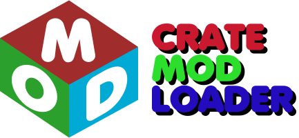

 

  
The all-in-one Randomizer and Mod Loader for console games.  
It detects, extracts, modifies and rebuilds disc image files and directories in an easy to setup way.  
In addition, it allows for standalone "Mod Crates" to be installed seamlessly into games.   
  

  
Visit the [Releases](https://github.com/TheBetaM/CrateModLoader/releases) section to find the latest release.  
  
See [this list](./GAMES.md) for supported games and their features in the current build.  
See [this list](./CONSOLES.md) for supported consoles in the current build.  

# Mod Crates

Place Mod Crates in the "Mods" folder for them to appear in the list.  
An example mod can be found in the "Mods" folder.  
Mod Crates can be folders or standard .zip files with these contents:  
(only ModCrateInfo.txt is mandatory for them to function, the rest is optional)  
- ModCrateInfo.txt with the details of the mod  
- ModCrateSettings.txt game-specific settings that can't be changed with modded files  
- ModCrateIcon.png icon of the mod displayed in the program  
- "layer0" folder - any files and folders inside will replace or add to the base extracted contents of the game ROM  
- "layer1" "layer2" etc. folders - supported games allow for replacement and/or addition of files in different game archives (check compatibility in [this list](./GAMES.md) or Games.txt)  
  
# Building Prerequisites

- Microsoft Visual Studio 2017 version 15.3 (C# 7.1)
- .NET 4.7

# Contributing

In order for a game to be included in a future release it must have at least two of the following:  
- Working randomizer of any kind (unless otherwise stated, must be completable without glitches)  
- Proof of concept mod  
- A fully implemented mod layer (extraction + packing)  
- Crate Mod Loader metadata edited into easily accessible text ingame  

# Contributors

- [BetaM](https://www.youtube.com/channel/UCL-EwV5XqypMUJ5zVHaBjAw) (Creator) 
- [ManDude](https://github.com/ManDude)  

# License

    This program is free software: you can redistribute it and/or modify
    it under the terms of the GNU General Public License as published by
    the Free Software Foundation, either version 3 of the License, or
    (at your option) any later version.

    This program is distributed in the hope that it will be useful,
    but WITHOUT ANY WARRANTY; without even the implied warranty of
    MERCHANTABILITY or FITNESS FOR A PARTICULAR PURPOSE.  See the
    GNU General Public License for more details.

    You should have received a copy of the GNU General Public License
    along with this program.  If not, see https://www.gnu.org/licenses/.
